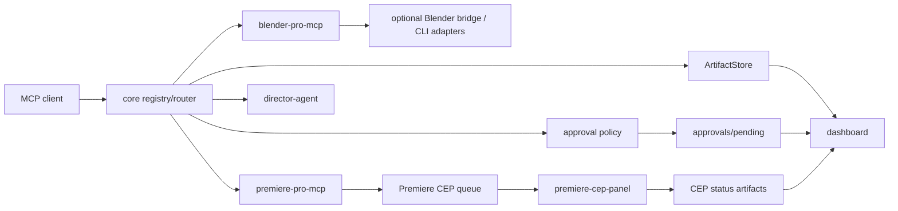

# Architecture

Creative Pipeline MCP is split into small packages:

- `core`: registry, router, job queue, approval policy, artifact store, QC report schema, license manifest
- `blender-pro-mcp`: glTF/GLB inspection, asset QC, preview/export/optimization artifact flow
- `premiere-pro-mcp`: media ingest, metadata indexing, rough cut plans, captions, audio/export plans, delivery QC
- `premiere-cep-panel`: minimal CEP panel scaffold for file-based Premiere IPC commands
- `blender-gpl-adapters`: optional GPL process-boundary manifests
- `premiere-windows-adapter`: CEP/WebSocket reference checks for Windows
- `dashboard`: artifact, QC report, and approval queue viewer

The dashboard reads `artifacts/approvals/pending`, resolves approve/reject decisions into `artifacts/approvals/resolved`, and reruns approved elevated tool requests with the approved risk level.

The public tool surface stays small. Low-level OSS integrations are adapter capabilities selected behind macro tools.

## System Diagram

## MCP Methods

The servers implement a stdio JSON-RPC subset:

- `initialize`
- `ping`
- `tools/list`
- `tools/call`

## Artifact Flow

All generated reports, previews, manifests, logs, captions, and OTIO plans are written under `artifacts/` by default.
